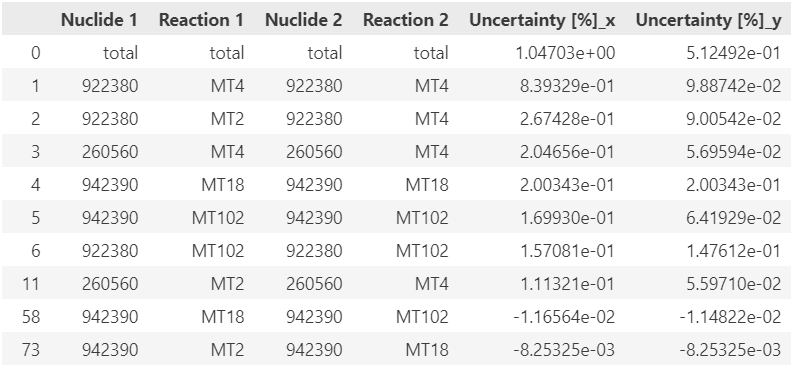

# Eigenvalue of MET1000

This example shows the capability for the TAR analysis. The package has to be imported to start with, and two additional packages for the analysis are also imported.

```python
import sauna
import pandas as pd
import numpy as np
```

Next, covariances and the sensitivities have to be imported as a basis for the optimization.

```python
covariances = sauna.Covariances()
covariances.library = 'ENDF-B-VII.1'
covariances.group_structure = sauna.GROUP_STRUCTURES['WPEC-SG46']
covariances.from_excels(f'../../covariances/{covariances.library}-7/')
```

```python
sensitivities = sauna.Sensitivities()
sensitivities.group_structure = sauna.GROUP_STRUCTURES['WPEC-SG46']
sensitivities.from_serpent('../../models/MET1000_FC_7_sens0.m') 
```

The following step is to create a dictionary with the functionals and the corresponding target accuracy requirements. Although SAUNA allows solving the TAR problem with a number of functionals and models, this example considers only the eigenvalue of MET1000, that is why, the dictionary contains only one item set to 0.3%.

```python
tars = {'Eigenvalue' : 0.003}
```

For a quick demonstration, it is suggested to set a small number of reactions for calling the TAR function. The lower boundary is set to 0.5% though it may still be too optimistic.

```python
target_covariances = sauna.Analysis.tars([sensitivities], covariances, tars, number_of_reactions=5, lower_boundary=5e-3, method='trust-constr')
```

After the solution is converged, one may assess how the uncertainty influence changes. The following code propagates the uncertainty for the base covariances and the target covariances, respectively, by exporting to Excel for a further analysis or use the pandas package. It should be noted that the result of the propagation will be different, because the optimization is done here only for the top five covariances and the corresponding channel-channel covariances while a substantial contribution also comes from the other reactions.

```python
dfs     = sauna.Analysis.get_breakdown(sensitivities, covariances)
new_dfs = sauna.Analysis.get_breakdown(sensitivities, target_covariances)

df1 = dfs['Eigenvalue'].copy(deep=True)
df2 = new_dfs['Eigenvalue'].copy(deep=True)
df2 = df2.drop(columns=['Statistical Uncertainty [%]'])
df1 = df1.drop(columns=['Statistical Uncertainty [%]'])
```

To get the comparison via the pandas capability, the `merge()` function can be used.

```python
merged_df = pd.merge(df1, df2, on=['Nuclide 1', 'Reaction 1', 'Nuclide 2', 'Reaction 2'])
```

The unchanged values can be dropped to further simplify the comparison.

```python
truncated_df = merged_df.drop(merged_df[(merged_df['Uncertainty [%]_x'] == merged_df['Uncertainty [%]_y'])].index)
truncated_df.head(10)
```

The expected result looks as it is presented in Fig. 1.

<figure><figcaption><p>Figure 1. Target Accuracy Requirements for MET1000 Eigenvalue using five covariance matrices</p></figcaption></figure>

To make it clearer, what the energy ranges are that encountered the largest change, the uncertainty propagation can be done by group.

```python
dfs     = sauna.Analysis.get_detailed(sensitivities, covariances)
new_dfs = sauna.Analysis.get_detailed(sensitivities, target_covariances)
df1 = dfs['Eigenvalue'].copy(deep=True)
df2 = new_dfs['Eigenvalue'].copy(deep=True)
df2 = df2.drop(columns=['Statistical Uncertainty [%]'])
df1 = df1.drop(columns=['Statistical Uncertainty [%]'])

merged_df = pd.merge(df1, df2, on=['Nuclide 1', 'Reaction 1', 'Group 1', 'Nuclide 2', 'Reaction 2', 'Group 2'])
truncated_df = merged_df.drop(merged_df[(merged_df['Uncertainty [%]_x'] == merged_df['Uncertainty [%]_y']) | (merged_df['Reaction 1'] != merged_df['Reaction 2']) | (merged_df['Group 1'] != merged_df['Group 2'])].index)
```

A deeper analysis would require sorting with various logic to isolate values with the largest impact depending on the user's purpose.
