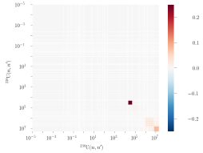
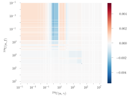

# Uncertainty Analysis

## Uncertainty sources

Results of neutron transport simulation contains a number of error sources. They are usually divided into three categories:

* numerical (methodological)
* technological (modeling)
* nuclear data (constant)

The first type corresponds to the numerical approximations such as the conventional for deterministic codes truncated expansions, multigroup approximations, self-shielding approximations, and so on. These approximations can be circumvented, thanks to the rapid development of computational power, via stochastic codes that rely on the description of the physics. Thus, the class of the codes is considered the most accurate though it is not free of other biases such as not an ideal random number generator, source convergence, scoring techniques and others. Most of them might be mitigated by a larger number of histories. In addition, throughout time some biases are continued being removed such as appearance of the probability table techniques to properly account self-shielding effects in the unresolved resonance region, temperature interpolation techniques, and resonance scattering.&#x20;

Next, the technological uncertainties are related to the aspect how accurate the "true" system is represented in the code such as homogenizing some components, dimensions, material composition, manufacturing tolerances, temperatures, etc.

Finally, the nuclear data uncertainties are considered as the main source of uncertainties, and the state has not been changed since 1950s due to continuous improvement in both the numerical and technological parts.

## Nuclear data uncertainty

The nuclear data are truly unknown, containing errors as a result of experiments. One can only state the knowledge of an average with the corresponding uncertainty. However, nuclear data are measured with respect to other data and contain the uncertainty not only in the value but also in the energy, introducing correlations between different energy ranges. Since the uncertainties are dependent on a number of parameters, the uncertainties of nuclear data are defined through covariance matrices, the multivariable equivalent of a dispersion.\
Each covariance matrix for reaction $$r$$ of nuclide $$n$$  corresponds to covariance between two energy points, $$g$$ and $$g'$$:

$$
[C(\alpha_{n,r},\alpha_{n,r})]_{g,g'}\equiv \text{cov}(\alpha_{n,r,g},\alpha_{n,r,g'})
$$

where $$\alpha_{n,r}$$ is the nuclear data parameter vector of reaction r of nuclide $$n$$ such as the values of $$^{238}\text{U}(n,n')$$ or $$^{235}\text{U}(\nu)$$; $$\alpha_{n,r,g}$$ is the $$g$$-element of vector $$\alpha_{n,r}$$, corresponding to a certain energy. This means that the matrix is symmetric, and the diagonal of the matrix contains dispersions, that is, the squared uncertainties. However, while ENDF files assume that the covariances are provided for energy points, the analysis is conducted via covariances for energy groups though there are techniques that allow propagating uncertainties using pointwise covariances. A transition from the pointwise form in ENDF files to the groupwise form is provided by processing codes such as NJOY and AMPX. An example of the processing result is presented below in the form of covariance matrix in Figure 1.

<figure><figcaption>
Figure 1. Covariance matrix of ^{238}\text{U}(n,n') in the SCALE 56-group approximations
</figcaption></figure>

As it was mentioned, the nuclear data contain correlations not only between energies but also between reactions, and these reactions can be related to different materials too. That is, $$C(\alpha_{n,r},\alpha_{n,r})$$ can be represented as $$C(\alpha_i,\alpha_j)$$ for brevity, where $$i,j \in (n,r)$$. An example of a channel-channel covariance matrix is depicted below in Figure 2. The same matrix is provided in an NJOY-like correlation form in FIgure 3.

<figure><figcaption>
Figure 2. Covariance matrix for covariances between ^{238}\text{U}(n,f) and ^{238}\text{U}(n,\gamma)
</figcaption></figure>

<figure><figcaption>
Figure 3. NJOY-like correlation matrix for covariances between ^{238}\text{U}(n,f) and ^{238}\text{U}(n,\gamma) 
</figcaption></figure>

## Uncertainty propagation

The influence of each covariance matrix on a functional, $$\Delta R_{i,j}$$ is assessed via the "sandwich rule" formula:

$$
\Delta R_{i,j}=\sqrt{S_i C_{i,j}S_j^T}
$$

where $$S_i \equiv S(R,\alpha_i)$$ is the sensitivity vector to the parameter vector and $$C_{i,j}\equiv C(\alpha_i,\alpha_j)$$.

Hence, the total influence of nuclear data uncertainty is a sum of each component:&#x20;

$$
\Delta R = \sqrt{\sum_{i,j}{\Delta R_{i,j}^2}}
$$

It shall be noted that this equation accounts that the channel-channel terms must be accounted twice. If only one non-symmetric matrix is used in an uncertainty propagation, i.e. only $$i,j$$ is accounted with no $$j,i$$, the result must be multiplied by two:

$$
\Delta R = \sqrt{\sum_{i}{\Delta R_{i,i}^2} + 2\sum_{i\neq j}\Delta R_{i,j}^2}
$$


This is applicable to any reaction, and it does not matter whether the matrix relates only to a channel-channel covariance matrix or a material-material covariance matrix, the "sandwich" result of these matrices must be accounted twice to correctly represent the uncertainty influence.


It should be noted that the approach above relies on the sensitivities. There is another approach, not considered here, that does not use them and conduct many simulations with randomly perturbed data according to their covariances. The different functional values as results of these simulations are analyzed yielding the average values of these functionals and their uncertainty. The approach is known as the random sampling approach and is not used by SAUNA.

