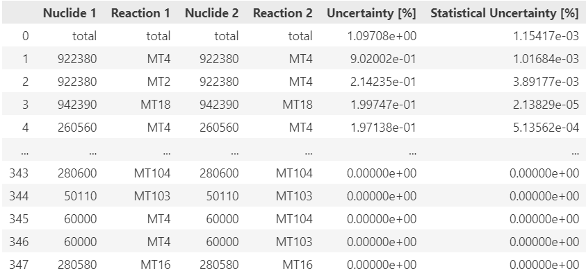

# Uncertainty Propagation

Having sensitivities and covariances, one can propagate the nuclear data uncertainty on the functionals. It can be done via the $$\texttt{Analysis}$$ module via a single line to get the total uncertainty influence and the main sources of the influence.

```python
dfs  = sauna.Analysis.get_breakdown(sensitivities, covariances)
```

The result of the method is a dictionary of functionals with the corresponding uncertainty breakdowns, which may be called in the following way.

```python
dfs['Eigenvalue']
```

<figure><figcaption></figcaption></figure>

In addition, the data can be exported into an Excel file by providing the path where to save the breakdown.

```
sauna.Analysis.get_breakdown(sensitivities, covariances, './breakdown.xlsx')
```

In some cases, a more detailed analysis may be of interest, the method $$\texttt{get_detailed()}$$ can be used to get the groupwise influence on the uncertainty. The method is used in the same way as $$\texttt{get_breakdown()}$$.

```
sauna.Analysis.get_detailed(sensitivities, covariances, './detailed_breakdown.xlsx')
```
