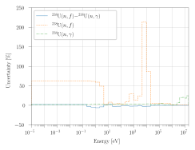
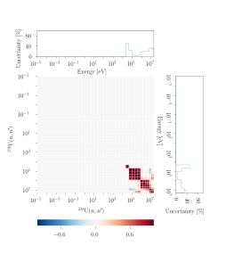

# Visualization

$$\texttt{Plot}$$ is the module responsible for the visualization. It contains templates for plotting the figures of interest in sensitivity and uncertainty analysis. It contains methods for plotting sensitivities, covariances, and uncertainties.&#x20;

## Sensitivity

Sensitivities are plotted via the $$\texttt{plot_sensitivity()}$$ method. The first parameter takes a list of $$\texttt{Sensitivity}$$ instances. The other parameters are optional. An example is provided below.

```python
sensitivities = [sensitivity_1, sensitivity_2]
sauna.Plot.plot_sensitivity(sensitivities, name = 'sensitivities', format = 'pdf', show_integral = True, normalization_type = 0, annotations = ['\nENDF/B-VII.1 (SCALE 6.2)', '\nENDF/B-VII.1 (Serpent)'], width=7.48)
```

$$\texttt{name}$$ and $$\texttt{format}$$ take the name and format of the image to be saved, respectively, which are passed to $$\texttt{matplotlib}$$.&#x20;

Next, $$\texttt{show_integral}$$ takes a bool value whether to show integral values of the sensitivities or not.

`show integral()` may take three values {0, 1, 2} that correspond to not normalizing, normalizing per unit energy, normalizing per unit lethargy. The value of 1 is recommended to use when different group structures are considered.

$$\texttt{annotations}$$ expects a list of string to be added to the legend, if necessary, for instance, to differentiate data from different tools.

The $$\texttt{width}$$ parameter is intended to provide the width of the plot to $$\texttt{matplotlib}$$ in inches. The default value is 3.54 inches as a recommended value by Elsevier for a one-column images. One may set 7.48 inches if a two-column image is of interest.

The result of using this method is depicted below in Figure 1.

<figure><figcaption><p>Figure 1. Sensitivity (profile) of the eigenvalue <span class="math">k</span> with respect to the cross section <span class="math">^{238}\textnormal{U}(n,n')</span> via KENO-IV of SCALE 6.2 and Serpent</p></figcaption></figure>

## Uncertainty

Uncertainties are plotted via the $$\texttt{plot_uncertainty()}$$ method. It works in a similar manner to sensitivities, and an example is provided below. If a channel-channel matrix is provided, the square root of the diagonal is presented (the signs of the diagonal elements are preserved).

```
covs = [covariance_1, covariance_2, covariance_3]
sauna.Plot.plot_uncertainty(covs, format = 'pdf', annotations = None, width=3.54)
```

The result is presented in Figure 2.

<div data-full-width="false"><figure><figcaption><p>Figure 2. Uncertainty (profile) of some <span class="math">^{238}\textnormal{U}</span> cross sectionns from ENDF/B-VII.1 in the 28-group ABBN approximation </p></figcaption></figure></div>

## Covariance and correlation matrices

Covariance and correlation matrices are plotted via the $$\texttt{plot_cov()}$$ and $$\texttt{plot_cor()}$$ methods respectively. Some examples of the method results have already been shown in [a first subsection](../theory-and-methodology/uncertainty-analysis.md). Here are the examples how these images can be plotted.

```python
sauna.Plot.plot_cov(covariance_1, name='U238-18-102', format = 'svg')
sauna.Plot.plot_cov(covariance_4, name='U238-4', format = 'svg')
sauna.Plot.plot_cor(covariance_4, name='corr-U238-4', format = 'svg')
sauna.Plot.plot_cor(covariance_1,covariance_2, covariance_3, name='corr-U238-18-102', format = 'svg')
```

<div><figure><figcaption><p>Figure 3. Covariance matrix of <span class="math">^{238}\textnormal{U}(n,f)- ^{238}\textnormal{U}(n,\gamma)</span> from ENDF/B-VII.1 in the 28-group ABBN approximation</p></figcaption></figure> <figure><figcaption><p>Figure 4. Covariance matrix of <span class="math">^{238}\textnormal{U}(n,n')</span> from ENDF/B-VII.1 in the 28-group ABBN approximation</p></figcaption></figure></div>

<div><figure><figcaption><p>Figure 5. Correlation matrix of <span class="math">^{238}\textnormal{U}(n,n')</span> from ENDF/B-VII.1 in the 28-group ABBN approximation</p></figcaption></figure> <figure><figcaption><p>Figure 6. Correlation matrix of <span class="math">^{238}\textnormal{U}(n,f)- ^{238}\textnormal{U}(n,\gamma)</span> from ENDF/B-VII.1 in the 28-group ABBN approximation</p></figcaption></figure></div>


Channel-channel correlation matrix plotting requires 3 matrices as inputs to get correlations from covariances:

* channel-channel matrix (covariance\_1)
* first channel matrix (covariance\_2)
* second channel matrix (covariance\_3)

